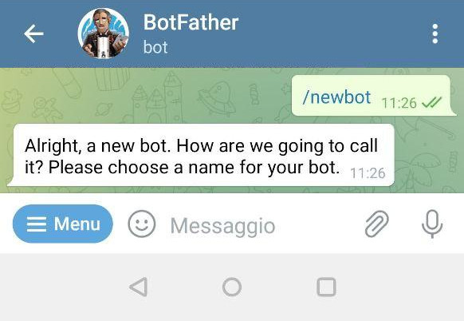

# Laravel-Bot-Telegram

### Бот для телеграмма, для получения статуса цикла на Цетусе в игре варфрейм через их апи

### Установка

### 1. Устанавливаем и делаем миграции

```
composer install
```
```
composer require defstudio/telegraph
```
```
php artisan vendor:publish --tag="telegraph-migrations"
```
```
php artisan migrate
```
```
cp .env.example .env
```
В .env в APP_URL вставляем публичный адрес на проект
```
APP_URL = ссылка
```
```
php artisan key:generate
```


### Запуск

### 2. Перейдем @BotFather в телеграмме

Отправляем /newbot, для создания бота и настраиваем его


Получаем токен бота

### 3.Добавляем бота в ларавель

Вводим 

```
php artisan telegraph:new-bot
```

Вставляем токен бота <br>
Называем бота <br>
Нет <br>
Да <br>

Бот создан поздравляю


### 4. Ставим хуки для бота

```
php artisan telegraph:set-webhook 1
```
